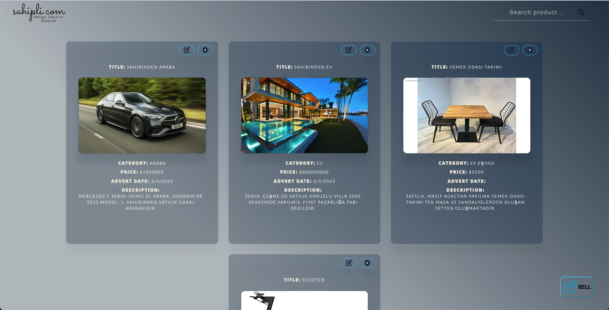
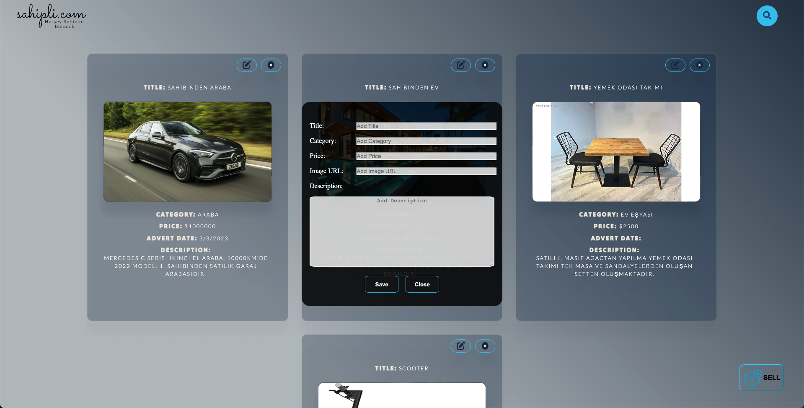
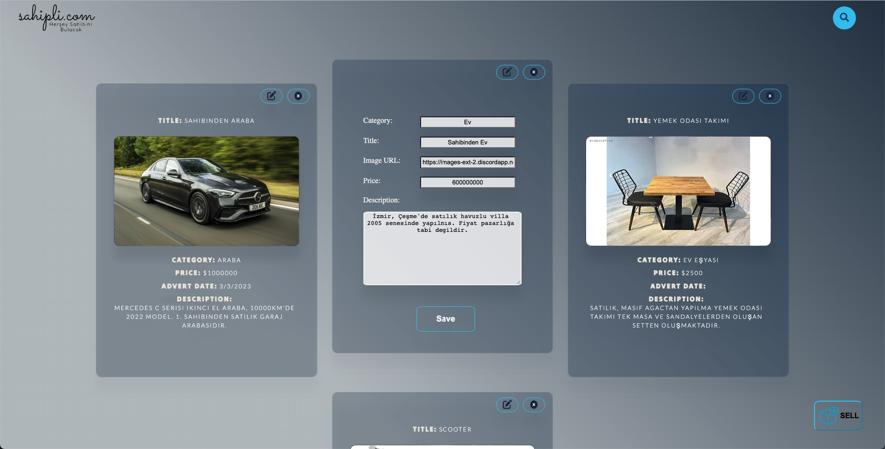
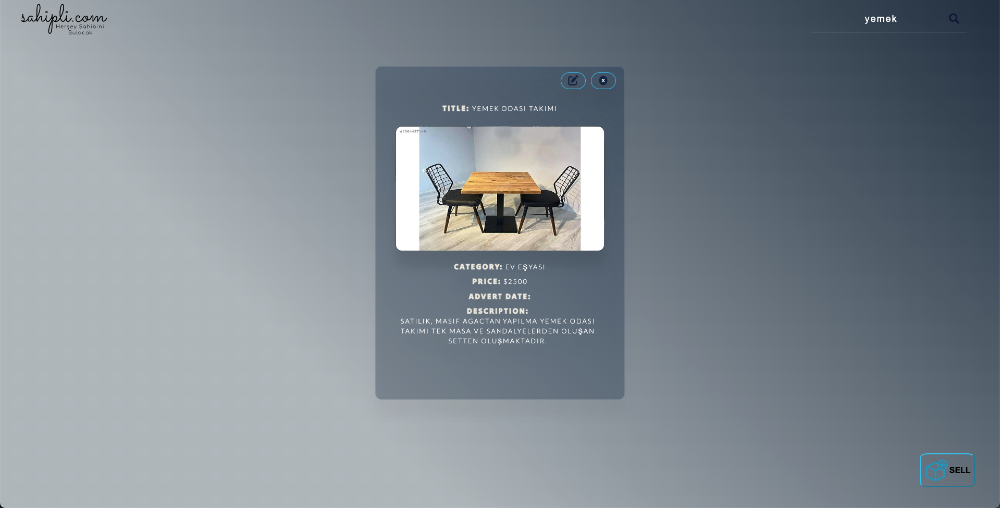

# Project: Sahipli.com

## <ins>Visualization of the website</ins>

- **Main Page Preview**

- **Sell Screen**

- **Edit Card Screen**

- **Search Bar Usage Preview**

## <ins>Description</ins>

> Project's main purpose is to supply a platform for people willing to sell and buy vintage items. This project basically uses simple CRUD methods to advertise the products customers want to sell.

## <ins>Technologies and Softwares used on this project</ins>

> - HTML
> - CSS
> - Javascript
> - ReactJS

## <ins>Libraries Used</ins>

> - axios
> - fontawesome

### <ins>Created By</ins>

> - Emre Kazancı
> - Mücahit İslam Doğan
> - Tunç Cenk Ergüven
